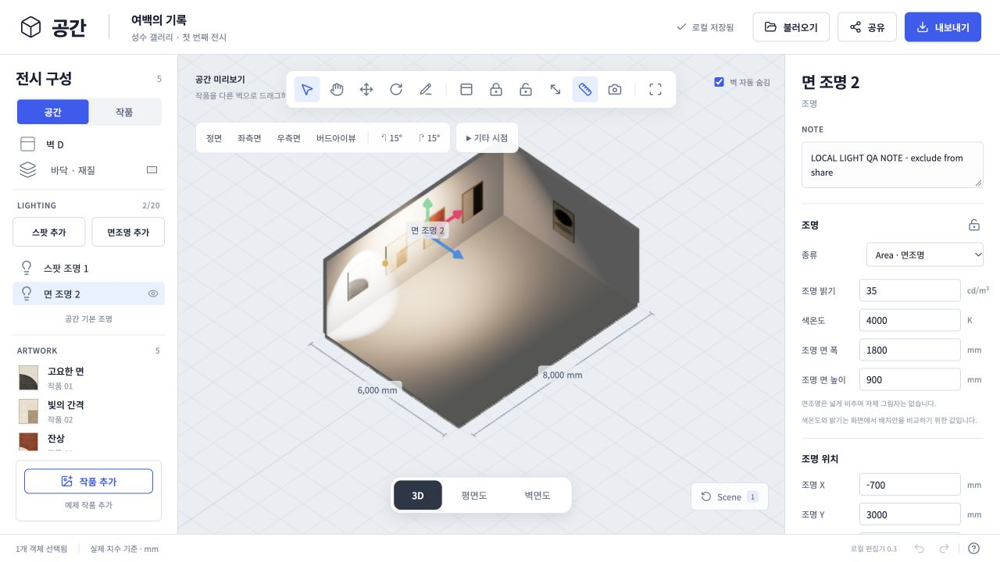
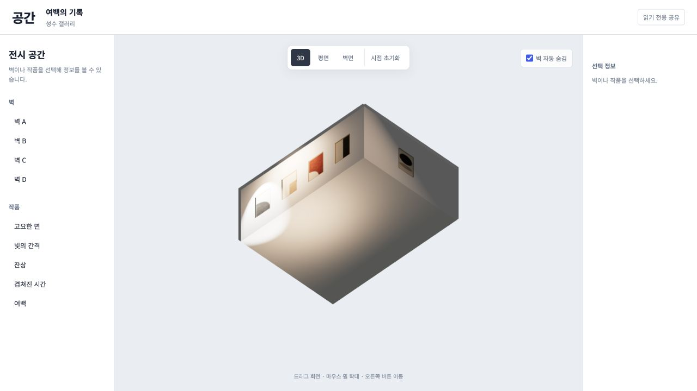

# 실내 전시 조명 — 2026-10-03

## 제공 기능

- Spot / Area를 독립 객체로 추가, 선택, 복제, 삭제, 표시/숨김, 잠금한다. 최대 20개다.
- 3D의 X/Y/Z 핸들과 평면도 점으로 이동한다. 위치와 조준점에 같은 변위를 적용한다. 숫자로 조준점을 변경하여 방향을 조절한다.
- 밝기, 2700–6500K, Spot 전체 조사각 1–150°, 가장자리, 도달 거리, 그림자를 편집한다. Area의 폭/높이는 실측 mm다.
- 주변광·전체 밝기·보조광·환경 반사를 별도 조절한다. 첫 조명 추가 시 개별 빛을 보기 좋은 낮은 주변광으로 시작한다. 기본 밝기 복원 버튼을 제공한다.
- Undo, 로컬 재로드, Scene, JSON, 자산 백업과 읽기 전용 공유에 조명 값을 유지한다. 이전 Scene에 조명 값이 없으면 현재 조명을 유지한다.
- 공유 허용 목록은 조명 메모/잠금과 다른 Scene을 제외한다. 조명 편집 핸들은 공유/3D 캡처/PDF에 넣지 않는다.

## 렌더링과 교환 파일

mm를 m로 변환하여 Three.js SpotLight/RectAreaLight를 만든다. Spot UI의 전체 조사각은 Three.js 반각으로 변환한다. Spot 밝기는 cd, Area는 cd/m²로 표시한다. [SpotLight](https://threejs.org/docs/pages/SpotLight.html), [RectAreaLight](https://threejs.org/docs/pages/RectAreaLight.html).

Area는 PBR 면광원의 조명 기여만 제공하고 자체 그림자를 만들지 않는다. 실시간 그림자는 visible/intensity>0인 Spot 중 순서상 첫 4개로 제한한다. Area LTC 초기화와 그림자 리소스 해제를 적용한다. 대형 장면/실기기 성능은 별도 검증이 필요하다.

Kelvin→sRGB는 [Tanner Helland의 근사식](https://tannerhelland.com/2012/09/18/convert-temperature-rgb-algorithm-code.html)을 지원 범위에 제한하여 사용하고 렌더링에서는 linear color로 변환한다. 실제 조명기구의 스펙트럼·조도 측정과 동일함을 주장하지 않는다.

GLB/glTF는 `KHR_lights_punctual` Spot을 보존한다. 독립 target을 Spot의 로컬 -Z 회전으로 바꿔 glTF 재입력 때 방향이 달라지지 않게 했다. Area·기본 주변광/반사·그림자 설정은 제외하고 UI와 glTF 보고서에 표시한다. 전체 편집 복원은 프로젝트 자산 백업을 사용한다. [GLTFExporter](https://threejs.org/docs/pages/GLTFExporter.html).

PDF는 독립 장면에 전체 실내 조명을 다시 구성한다. PNG는 현재 화면 조명을 사용한다. 둘 다 편집 데이터를 변경하지 않는다.

## 검증 증거와 한계

- 594 tests passed, 2 optional benchmarks skipped; TypeScript/production build passed.
- 숫자/좌표/범위/중복 ID, 20개 한도, 잠금, 이동 방향 유지, 한 번의 Undo, Scene 독립 값과 이전 파일 호환, ZIP 복원, Worker 허용 목록을 검증했다.
- 실제 바이너리 GLB→GLTFLoader에서 밝기/각도/방향을 확인했고 실제 glTF ZIP의 CRC·광원·회전·Area 제외 보고서를 확인했다.
- 로컬 Wrangler `127.0.0.1:8799`에서 3D Y 이동/Undo, 평면 XZ 이동/Undo, 색온도 2700/6500, 조사각 40/70, 밝기 0/85, Area 1800×900mm/35cd/m², 잠금, 복제/삭제, Scene 복원/재로드를 실제 UI로 확인했다.
- 로컬 전용 R2 및 테스트 키로 공유 뷰어를 열어 같은 조명과 읽기 전용 상태를 확인했다. 응답에는 빛 두 개와 기본 밝기만 포함되고 메모·잠금·다른 Scene은 없었다. 배포 서버에는 QA 스냅샷을 만들지 않았다.
- PNG/PDF/GLB/ZIP 생성 UI는 오류 없이 완료됐다. 이번 내장 브라우저의 download event가 시간 초과됐고 새 Downloads 파일이 확인되지 않아 내려받은 PDF/PNG의 육안/파일 검사는 미검증이다. 자동 GLB/glTF/백업 검증과 UI 생성 검증을 구분한다.
- 좁은 화면에서 상단 아이콘의 이름이 사라지는 문제를 발견하여 불러오기/공유/내보내기에 aria-label을 추가했다. 모바일 실기기 검증은 아니다.

Cloudflare 배포 버전: `de90f62d-cf9f-4b55-bd93-58ea6639a8fd`. 공개 HTTPS에서 새 메뉴·기본 조명 창과 콘솔 오류 없음을 확인했으며 공개 편집 데이터는 변경하지 않았다.

T8 전체 완료가 아니다. 야외 환경·태양·날짜/시간/북쪽, 3D 작품, 계정별 저장, SKP 변환과 대표 기기 성능 검증이 남아 있다.
